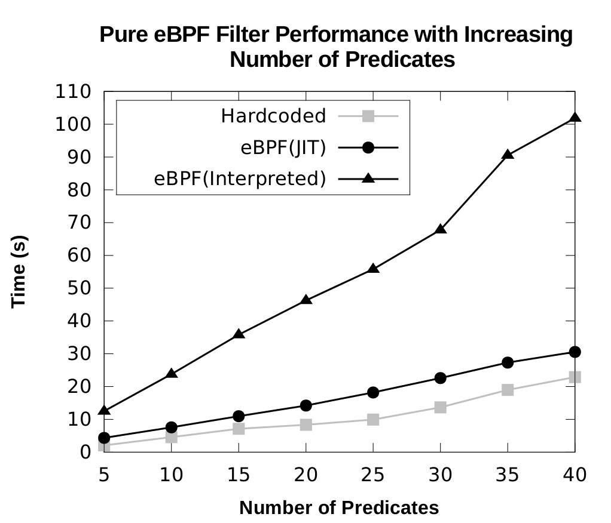

libebpf μ-Benchmark
===================

This μ-benchmark is used to measure how the userspace eBPF performs in terms of number of filter predicates and events filtered.
We measure JIT vs interpreted bytecode performance for varying number of predicates and for varying events - both for biased TRUE and biased
FALSE conditions of filter evaluation. We also compare the performance with LTTng's filter bytecode interpretation.

Usage
-----

Place the ubenchmark directory in libebpf directory first. Then vary the number of predicates by changing `NR_STR` in `build_filters.sh`. Then,

    $ ./build-filters.sh

This builds the filters and the test cases using templates and the 'generator.py' script provided. Afterwards, `overhead-pure.sh` or `overhead-lttng.sh` can be run to generate raw results.
Postprocessing on the results is done using the respective R files and results are stored in `results` directory.

Sample
------

A sample run of the benchmark is done on a Intel Core i7-3370 @ 3.4 GHz with 12 GB memory. Results for JIT vs Interpreted eBPF
performance are shown for varying predicates with a TRUE biased filter.  

License and Copyright
---------------------
Copyright (C) 2015 Suchakra Sharma <suchakrapani.sharma@polymtl.ca>

For all the code in this repo, GPLv2. For eBPF implementation, original copyright holders are Linux kernel developers who worked on kernel BPF.
